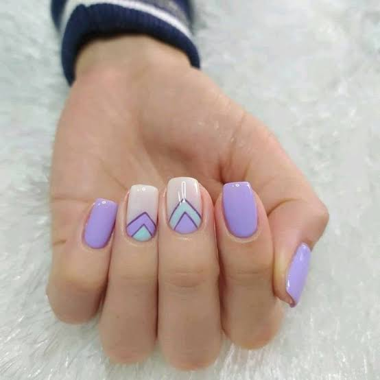
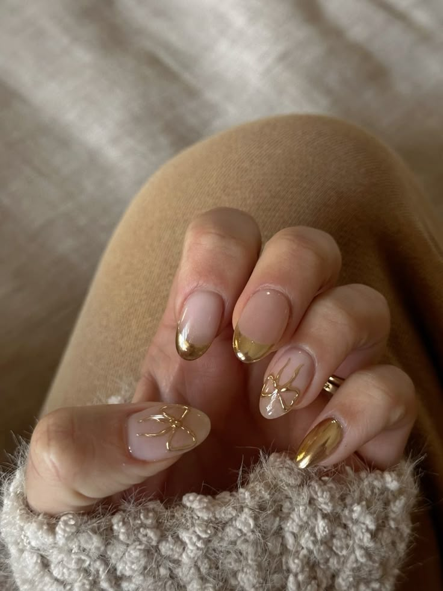
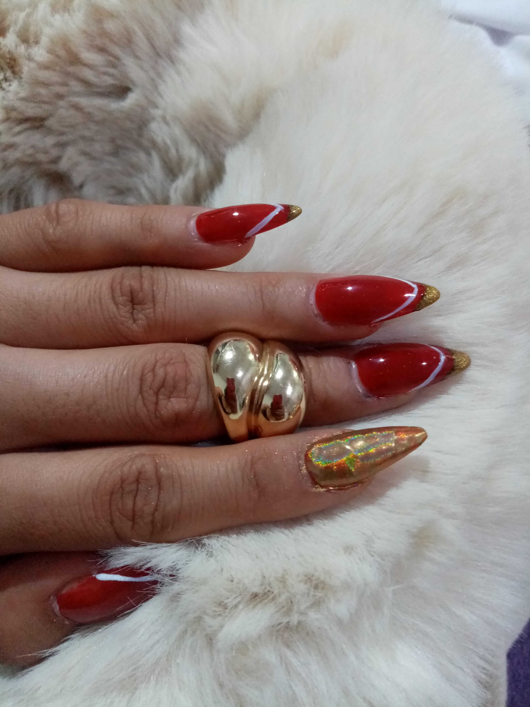
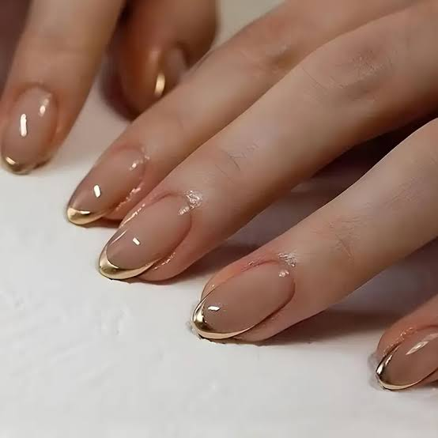

# 💅✨ UñasMar ✨💅

<p align="center">
  <b>Tu espacio para lucir unas uñas espectaculares</b>
  <br>
  <i>“Tu belleza exterior capturará los ojos pero tu belleza interior conquistará el corazón.”</i>
  <br>
  <b>— Steven Aitchison</b>
</p>

---

## 🌈 Servicios que ofrecemos

<div align="center">

| 💅 | ✨ | 🌸 | 🎨 | 🦋 |
|---|---|---|---|---|
| <b>Manicuras clásicas</b> | <b>Manicura rusa</b> | <b>Uñas acrílicas</b> | <b>Gel semipermanente</b> | <b>Soft Gel / Polygel</b> |

</div>

---

## 🖼️ Galería de servicios

<p align="center">
  
  
  
  
  
</p>

---

## 🚀 Características principales

- 🌟 **Diseño responsivo y moderno** usando Bootstrap 5
- 🎯 **Catálogo visual** de servicios y técnicas de uñas
- 🖌️ **Estilos personalizados** para una experiencia única
- 👩‍🎨 **Acerca de mí:** Conoce al talento detrás de U-asMar
- 📸 **Imágenes de alta calidad** en cada sección
- 🎉 **Interactividad**: Explora cada servicio y descubre más

---

## 🛠️ ¿Cómo ver el sitio?

1. **Clona el repositorio**  
   ```bash
   git clone https://github.com/GREGORIO971117/U-asMar.git
   ```
2. **Abre** el archivo `index.html` en tu navegador favorito  
   ¡Y listo! Disfruta del recorrido por nuestros servicios.

---

## 🗂️ Estructura del proyecto

```
U-asMar/
├── index.html
├── acercaDeMi.html
├── assets/
│   ├── images/
│   ├── styles/
│   └── js/
└── ...
```

---

## 👩‍💻 Créditos

Creado con 💖 por [GREGORIO971117](https://github.com/GREGORIO971117)

---


<p align="center">
  <b>¡Agenda tu cita y luce unas uñas espectaculares!</b>
</p>
